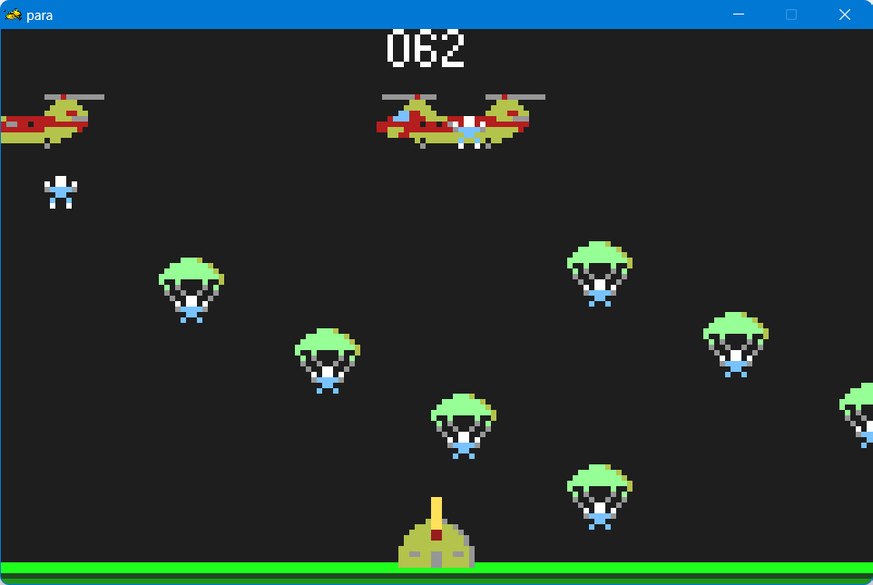

# paratroopers
 Atari Lynx game 'paratroopers'.
 
 This is a simple game project for Atari Lynx to learn 6502 assembley programming using Lyxass assembler.
 
 It is basically a clone of, or inspired by, the old Apple II game "Sabotage!".
 
 <picture>
    
</picture>
 
 
 Refer to discussion on this forum:
 https://forums.atariage.com/topic/368698-lyxass-learning-project-paratroopers/

To build:
1. Install lyxass assembler 
2. Copy folder "paratroopers" into the "lyxass" folder
3. Edit setenv.bat in paratroopers folder to point to your lyxass/new_bll folder
4. Run "make" from the paratroopers folder

If it does not build, you may have to edit Makefile to match your setup.